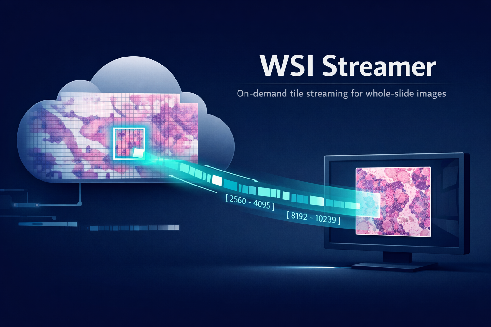

# WSI Streamer

[](https://github.com/PABannier/WSIStreamer/actions/workflows/CI.yml)
[](https://crates.io/crates/wsi-streamer)
[](https://github.com/PABannier/WSIStreamer/pkgs/container/wsistreamer)

A modern, cloud-native tile server for Whole Slide Images. One command to start serving tiles directly from S3.



```bash
wsi-streamer s3://my-slides-bucket
```

That's it. No configuration files, no local storage, no complex setup. Open `http://localhost:3000/view/sample.svs` in your browser to view a slide.

## Why WSI Streamer?

Whole Slide Images are large (1-10GB+) and typically live in object storage. Traditional viewers require downloading entire files before serving a single tile. WSI Streamer takes a different approach: it understands slide formats natively, fetches only the bytes needed via HTTP range requests, and returns JPEG tiles immediately.

- **Range-based streaming** — fetches only the bytes needed for each tile, no local files
- **Built-in viewer** — OpenSeadragon-based web viewer with pan, zoom, and dark theme
- **Native format support** — Rust parsers for Aperio SVS and pyramidal TIFF
- **Production-ready** — HMAC-SHA256 signed URL authentication
- **Multi-level caching** — slides, blocks, and encoded tiles

## Installation

Install from [crates.io](https://crates.io/crates/wsi-streamer):

```bash
cargo install wsi-streamer
```

Or build from source:

```bash
git clone https://github.com/PABannier/WSIStreamer.git
cd WSIStreamer
cargo build --release
```

Or run with Docker:

```bash
# Pull from GitHub Container Registry
docker run -p 3000:3000 -e WSI_S3_BUCKET=my-bucket ghcr.io/pabannier/wsistreamer:latest

# Or use Docker Compose for local development with MinIO
docker compose up --build
```

## Usage

### Basic

```bash
# Serve slides from S3
wsi-streamer s3://my-slides

# Custom port
wsi-streamer s3://my-slides --port 8080

# S3-compatible storage (MinIO, etc.)
wsi-streamer s3://slides --s3-endpoint http://localhost:9000
```

### API

```bash
# List slides
curl http://localhost:3000/slides

# Get slide metadata
curl http://localhost:3000/slides/sample.svs

# Fetch a tile (level 0, position 0,0)
curl http://localhost:3000/tiles/sample.svs/0/0/0.jpg -o tile.jpg

# Get thumbnail
curl "http://localhost:3000/slides/sample.svs/thumbnail?max_size=256" -o thumb.jpg
```

### Authentication

```bash
# Enable HMAC-SHA256 authentication
wsi-streamer s3://my-slides --auth-enabled --auth-secret "$SECRET"

# Generate signed URLs
wsi-streamer sign --path /tiles/slide.svs/0/0/0.jpg --secret "$SECRET" --base-url http://localhost:3000
```

The web viewer handles authentication automatically when enabled.

### Validation

```bash
# Check S3 connectivity
wsi-streamer check s3://my-slides

# List available slides
wsi-streamer check s3://my-slides --list-slides

# Test a specific slide
wsi-streamer check s3://my-slides --test-slide sample.svs
```

## Configuration

All options can be set via CLI flags or environment variables:

| Option | Env Var | Default | Description |
|--------|---------|---------|-------------|
| `--host` | `WSI_HOST` | `0.0.0.0` | Bind address |
| `--port` | `WSI_PORT` | `3000` | HTTP port |
| `--s3-bucket` | `WSI_S3_BUCKET` | — | S3 bucket name |
| `--s3-endpoint` | `WSI_S3_ENDPOINT` | — | Custom S3 endpoint |
| `--s3-region` | `WSI_S3_REGION` | `us-east-1` | AWS region |
| `--auth-enabled` | `WSI_AUTH_ENABLED` | `false` | Enable authentication |
| `--auth-secret` | `WSI_AUTH_SECRET` | — | HMAC secret key |
| `--cache-slides` | `WSI_CACHE_SLIDES` | `100` | Max slides in cache |
| `--cache-tiles` | `WSI_CACHE_TILES` | `100MB` | Tile cache size |
| `--jpeg-quality` | `WSI_JPEG_QUALITY` | `80` | JPEG quality (1-100) |
| `--cors-origins` | `WSI_CORS_ORIGINS` | any | Allowed CORS origins |

Run `wsi-streamer --help` for full details.

## API Reference

| Endpoint | Description |
|----------|-------------|
| `GET /health` | Health check |
| `GET /view/{slide_id}` | Web viewer |
| `GET /tiles/{slide_id}/{level}/{x}/{y}.jpg` | Fetch tile |
| `GET /slides` | List slides |
| `GET /slides/{slide_id}` | Slide metadata |
| `GET /slides/{slide_id}/thumbnail` | Thumbnail |
| `GET /slides/{slide_id}/dzi` | DZI descriptor |

See [API_SPECIFICATIONS.md](./API_SPECIFICATIONS.md) for complete documentation.

## Supported Formats

| Format | Extensions | Compression |
|--------|------------|-------------|
| Aperio SVS | `.svs` | JPEG, JPEG 2000 |
| Pyramidal TIFF | `.tif`, `.tiff` | JPEG, JPEG 2000 |

Files must be tiled (not stripped) and pyramidal.

## License

MIT. See [LICENSE](./LICENSE).

## Contributing

Issues and pull requests welcome. See [CONTRIBUTING.md](./CONTRIBUTING.md).
